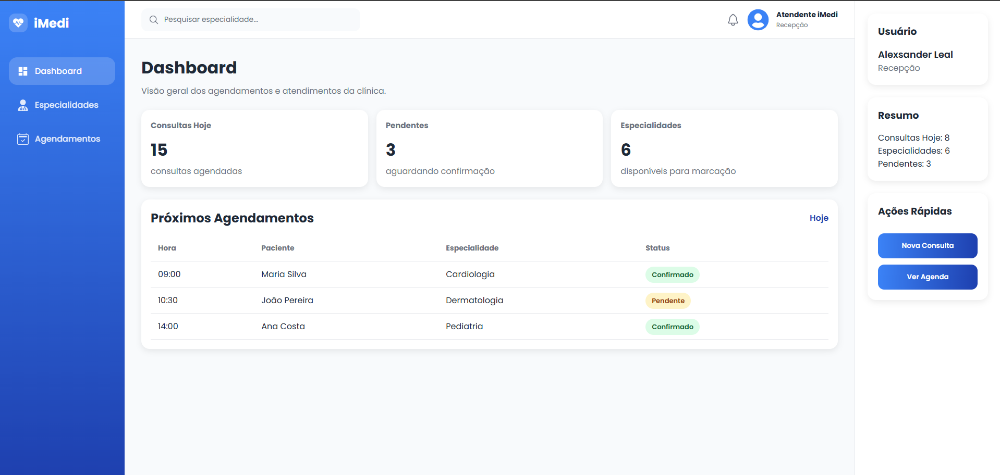
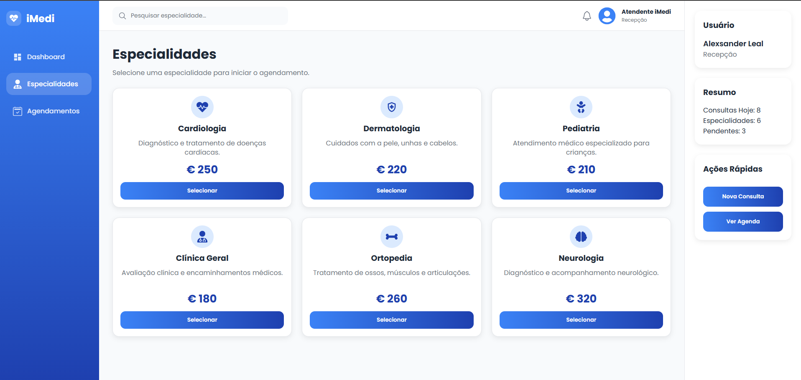
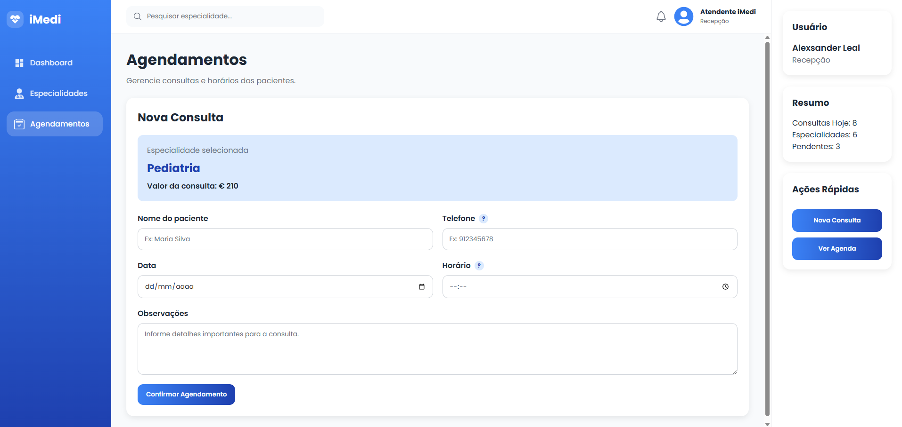

# 🏥 iMedi

## 📸 Capturas de Tela

### Dashboard



### Especialidades



### Agendamentos



Sistema de agendamento de consultas médicas desenvolvido como MVP da disciplina **Desenvolvimento Front-End Avançado** da Pós-Graduação Full Stack.

O projeto foi construído utilizando React e tem como objetivo oferecer uma interface moderna, intuitiva e responsiva para recepcionistas e atendentes realizarem o gerenciamento inicial de consultas médicas.

---

## 📌 Objetivo

O iMedi foi desenvolvido para simplificar o processo de agendamento de consultas em clínicas médicas, permitindo a navegação entre especialidades, consulta de informações detalhadas e registro de novos agendamentos.

---

## 🚀 Funcionalidades

### Dashboard

* Resumo de consultas do dia
* Quantidade de pendências
* Quantidade de especialidades disponíveis
* Tabela de próximos agendamentos

### Especialidades

* Listagem dinâmica de especialidades médicas
* Cards reutilizáveis
* Navegação para página de detalhes

### Detalhes da Especialidade

* Exibição de informações detalhadas
* Navegação para agendamento
* Utilização de parâmetros dinâmicos na URL

### Agendamentos

* Formulário funcional de agendamento
* Validação de telefone
* Feedback visual de sucesso
* Limpeza automática do formulário
* Ações rápidas após confirmação

### Busca

* Busca por especialidades médicas
* Pesquisa sem diferenciação de acentos
* Mensagem de especialidade não encontrada

### Usabilidade

* Tooltip de ajuda contextual
* Feedback visual para ações do usuário
* Página 404 personalizada
* Interface responsiva

---

## 🛠 Tecnologias Utilizadas

* React
* Vite
* JavaScript
* CSS3
* React Router DOM
* React Icons

---

## 🧩 Componentes Reutilizáveis

O projeto utiliza componentização para facilitar manutenção e reutilização de código.

Principais componentes:

* MainLayout
* Sidebar
* Topbar
* RightPanel
* Card
* EspecialidadeCard
* Tooltip

---

## ⚙️ Hooks Utilizados

### useState

Utilizado para:

* Controle de formulários
* Controle de dados simulados
* Controle de mensagens e feedbacks

### useEffect

Utilizado para:

* Simulação de carregamento de dados
* Controle de mensagens temporárias

### useNavigate

Utilizado para navegação programática entre páginas.

### useLocation

Utilizado para envio e recebimento de dados durante a navegação.

### useParams

Utilizado para captura de parâmetros da URL.

---

## 🗂 Estrutura do Projeto

```text
src
│
├── assets
├── components
│   ├── Card
│   ├── EspecialidadeCard
│   ├── MainLayout
│   ├── RightPanel
│   ├── Sidebar
│   ├── Tooltip
│   └── Topbar
│
├── data
│   ├── agendamentosData.js
│   ├── dashboardData.js
│   └── especialidadesData.js
│
├── pages
│   ├── Dashboard
│   ├── Especialidades
│   ├── EspecialidadeDetalhes
│   ├── Agendamentos
│   └── NotFound
│
├── routes
└── styles
```

---

## 🌐 Rotas Disponíveis

| Rota                | Descrição                 |
| ------------------- | ------------------------- |
| /                   | Dashboard                 |
| /especialidades     | Lista de especialidades   |
| /especialidades/:id | Detalhes da especialidade |
| /agendamentos       | Formulário de agendamento |
| *                   | Página 404                |

---

## 📱 Responsividade

A aplicação foi testada e ajustada para:

* Desktop (1920px)
* Tablet (768px)
* Mobile (425px)
* Mobile (375px)

Foram realizados ajustes específicos para:

* Sidebar
* Topbar
* Dashboard
* Especialidades
* Agendamentos

---

## 🔄 Simulação de API

Os dados utilizados no MVP são simulados através de arquivos JavaScript localizados na pasta:

```text
src/data
```

O consumo dos dados é realizado utilizando:

* useState
* useEffect

Essa abordagem facilita futuras integrações com APIs REST e backend em Spring Boot.

---

## 🔮 Melhorias Futuras

### Sistema

* Login e autenticação
* Controle de permissões
* Dark Mode
* Internacionalização

### Pacientes

* Cadastro completo
* Histórico médico
* Pesquisa de pacientes

### Médicos

* Cadastro de médicos
* Controle de disponibilidade
* Agenda individual

### Integrações

* Spring Boot
* API REST
* PostgreSQL
* WhatsApp
* Google Calendar

---

## ▶️ Como Executar o Projeto

Clone o repositório:

```bash
git clone <URL_DO_REPOSITORIO>
```

Acesse a pasta do projeto:

```bash
cd imedi-react
```

Instale as dependências:

```bash
npm install
```

Execute o projeto:

```bash
npm run dev
```

---

## 👨‍💻 Autor

Alexsander Leal

GitHub:
https://github.com/Leal86

LinkedIn:
https://www.linkedin.com/in/alexsanderleal86/

Projeto desenvolvido como MVP da disciplina Desenvolvimento Front-End Avançado da Pós-Graduação Full Stack.
